[](https://twitter.com/iKurasad) 

<p>
  <a href="https://github.com/DPulavarthy/rita" target="_blank">
    
  </a>

  <h3 align="center"> 💠 Rita 💠 </h3>
  <p align="center">
    A Discord bot with some cool features
    <br />
    <a href="https://kura.gq"><strong> Visit the creator » </strong></a>
    <br />
    <br />
    <a href="https://support.jonin.gq"> Contact </a>
    ·
    <a href="https://github.com/DPulavarthy/rita/issues"> Report Bug </a>
    ·
    <a href="https://github.com/DPulavarthy/rita/issues"> Request Feature </a>
  </p>
</p>

### About
Rita is your bot helper with simple to use commands and only responds to the owner. Created in Discord.JS v12 this bot is lightweight and fast. Some features include: AI chat, text tags, [music commands](https://github.com/eritislami/evobot), and more!

⚠️ ***NOTE:*** Due to the existence of text/image tags, the bot cannot be hosted on [Heroku](http://heroku.com), my version is hosted on a Raspberry Pi.

### Image tags


### Text tags


### Logs
Rita logs command use in a clear way with the runtime for each command in seconds
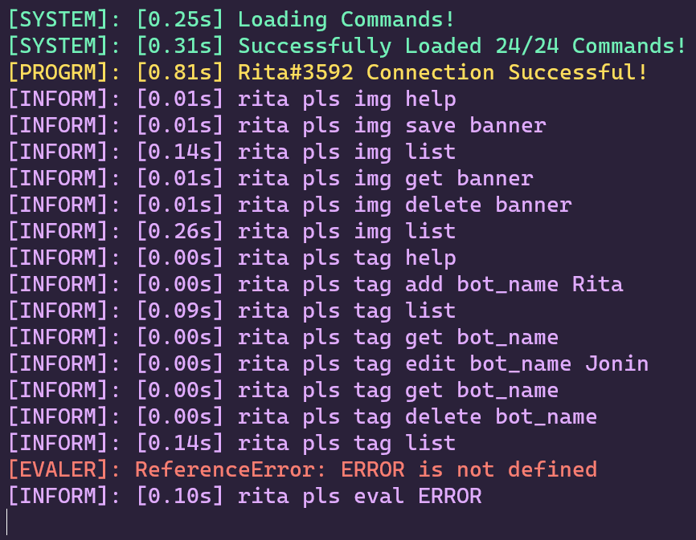

### How to Use
⚠️ ***NOTE:*** This bot's complexity of the code is not meant for beginners and might be confusing. But if you do not know how it works, I will gladly help you. (Discord: [Kurasad#2521](https://discord.com/users/476812566530883604)). This bot is made for advanced programmers; if you cannot understand anything about this bot, it might not be the right fit for you.

After forking the project add the proper information for the following files.

Find `.env.example` in the directory `./.env.example` and rename the file to `.env` and edit the file, the following should be shown
  
```
TOKEN=DISCORD_BOT_TOKEN
PREFIX=DISCORD_BOT_PREFIX
```

Fill in with the proper information (Go to the [Discord Developer Portal](https://discord.com/developers/applications) and get a bot token), The prefix checks for args instead of characters so use a prefix such as `rita pls` instead of `!r` [Need help getting a token?](https://github.com/DPulavarthy/rita#need-help-getting-a-bot-token-made-on-october-12-2020)

Once the `.env` file is properly filled out open the following directory `./resources/util.js.example`

Fill out the information with the required data

```js
module.exports = {
    owner: {
        id: "OWNER_DISCORD_ID",
        link: "OWNER_SOCIAL_LINK",
        site: "OWNER_WEBSITE_LINK",
        playlist: "PRESET_YOUTUBE_PLAYLIST_LINK"
    },
    main: "#MAIN_EMBED_COLOR_HEX",
    failed: "#FF0000",
    loading: "#2E6FD6",
    key: {
        alexa: "aw2plm",
        google: "GOOGLE_API_KEY"
    }
}
```
[Need help getting your User ID?](https://github.com/DPulavarthy/rita#need-help-getting-your-user-id-made-on-october-12-2020) or [Need help getting a Google API key?](https://github.com/DPulavarthy/rita#need-help-getting-a-google-api-key-made-on-october-12-2020)

⚠️***NOTE:*** The Alexa API key is a public key from [NPM alexa-bot-api](https://www.npmjs.com/package/alexa-bot-api)

⚠️***NOTE:*** The owner id is important, without it the bot will not respond to anyone. Remember, this is a private bot so it will only respond to the owner

Then, rename the folder `data.example` to just `data`

⚠️***NOTE:*** The data folder is where data for the bot is saved, without renaming it, the bot will likely crash.

Once those three things are updated, 'cd' to the bot directory through terminal/command prompt

run `npm i` and then `node rita.js` 

⚠️***NOTE:*** The index file is rita.js and not index.js, and `npm i` will install all the necessary modules for the bot to function.

### Other
Feedback is an amazing thing and feature additions are awesome, but to keep this bot simple I will try to only accept requests that do not change the bot much or majorly impact the speed.

I am the bot creator of [Jonin](https://top.gg/bot/662517805983334416) and after many requests wanted to make a simpler bot for public use.

If you understand this code, amazing.. come [hangout](https://discord.gg/H5PwwSJ) with me or help me develop [Jonin](https://top.gg/bot/662517805983334416/)

## Command list as of October 12, 2020
### I will be settting the prefix to mine (`rita pls`) in the table below

| General | Music |
|---------|-------|
| `rita pls` about <br /> `rita pls` ask <br /> `rita pls` debug <br /> `rita pls` directory <br /> `rita pls` eval <br /> `rita pls` explain <br /> `rita pls` help <br /> `rita pls` img <br /> `rita pls` ping <br /> `rita pls` reload <br /> `rita pls` source <br /> `rita pls` tag <br /> `rita pls` uptime | `rita pls` loop <br /> `rita pls` np <br /> `rita pls` pause <br /> `rita pls` play <br /> `rita pls` preset <br /> `rita pls` queue <br /> `rita pls` remove <br /> `rita pls` resume <br /> `rita pls` search <br /> `rita pls` shuffle <br /> `rita pls` skip <br /> `rita pls` stop <br /> `rita pls` volume |

# Guides below 👇

## Need help getting a bot token? (Made on October 12, 2020)

### Step 1: Discord Developer Portal
Go to the [Discord Developer Portal](https://discord.com/developers/applications) and either make a new application or pick the application that you want to use for this bot.


### Step 2: Making the bot
Once an application is chosen, direct yourself to the `Bot` tab, this is where you can create a bot to add to your server.


### Step 3: Getting the token
After you read the popup and agree by clicking `Yes, do it!`, you will have a bot to use. Copy the token field of the new bot by either clicking on the `Copy` field or clicking on `Click to Reveal Token` and copying the string.
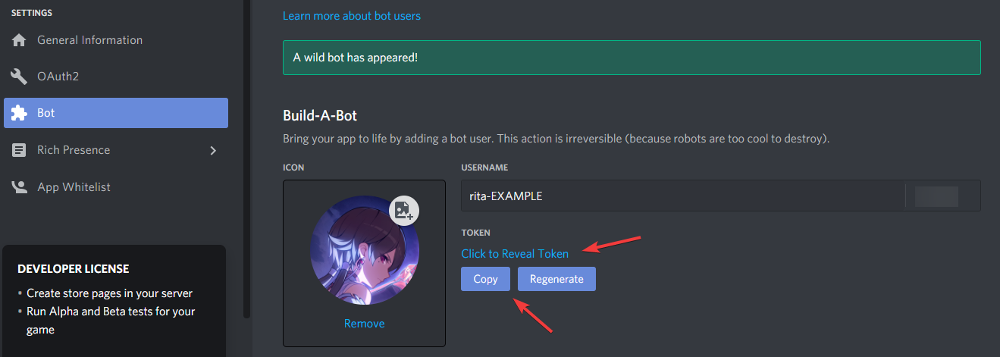

### Step 4: Putting it on the bot
The last thing to do is to put it on the bot, to do this open the `.env` file found at `./.env`, paste the token in the `TOKEN=` field.


## Need help getting your User ID? (Made on October 12, 2020)

### Step 1: Go to Discord
Start by going to [Discord](https://discord.com)'s website and logging in with the account that you want the bot to respond to. Then click on your user settings icon.
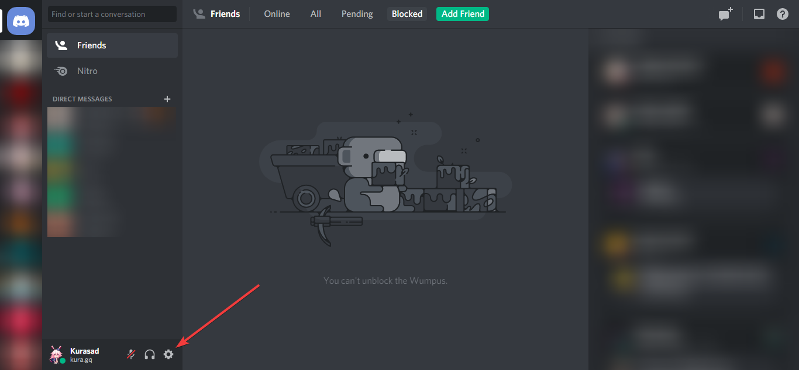

### Step 2: Enable Developer Mode
Direct yourself to the `Appearence` Tab in settings and scroll down to view and toggle the `Developer Mode` setting if not already done.
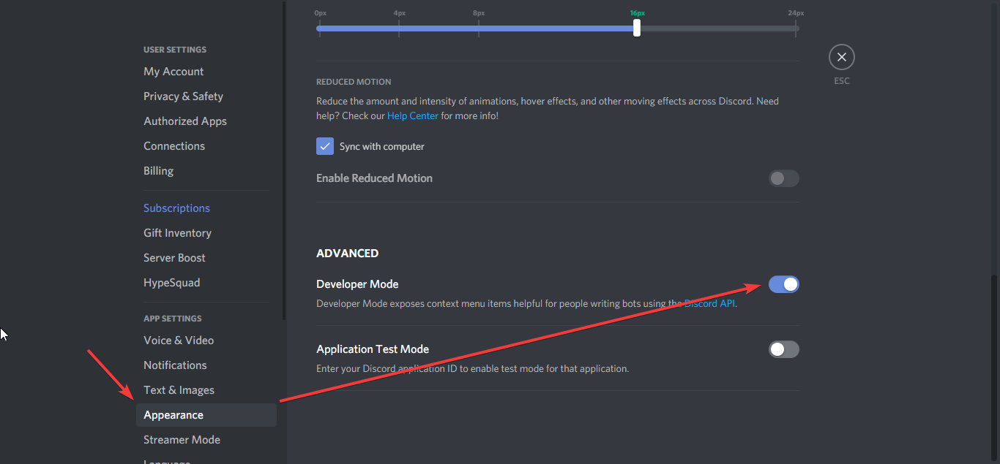

### Step 3: Getting the ID
After the `Developer Mode` has been enabled, you can close the setting by clicking the `X` icon in the top right or using the `esc` key on your keyboard.
Now right click on your user, and click on `Copy ID`, this is the ID that you want to put into the `id` field of the `util.js` file located in `./resources/util.js`
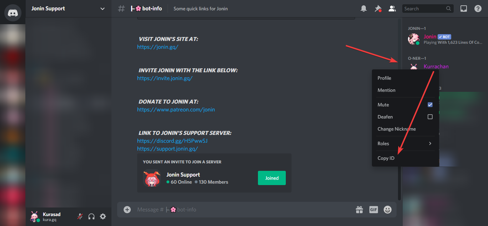

## Need help getting a Google API key? (Made on October 12, 2020)

### Step 1: Go to the Developer Console
Visit [Google's API Dashboard](https://console.developers.google.com) and create a new application, or choose an application that you have already created for this bot.
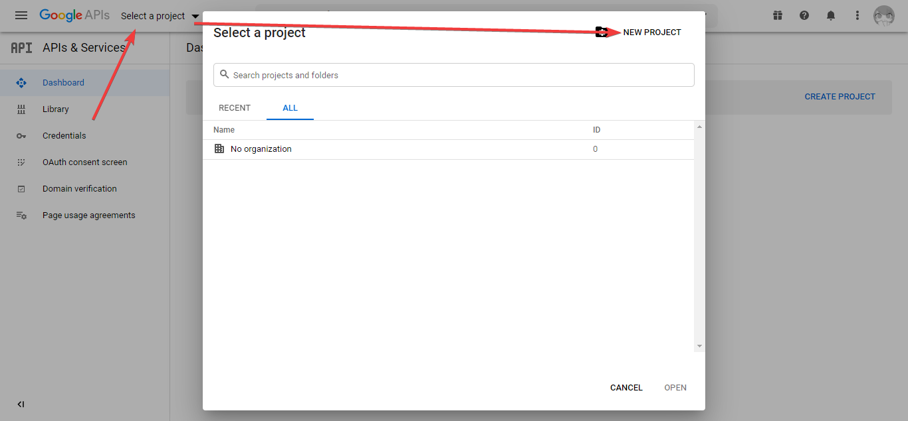

### Step 2: Create the project
Give the project a name and then click on the `Create` button to make the project.
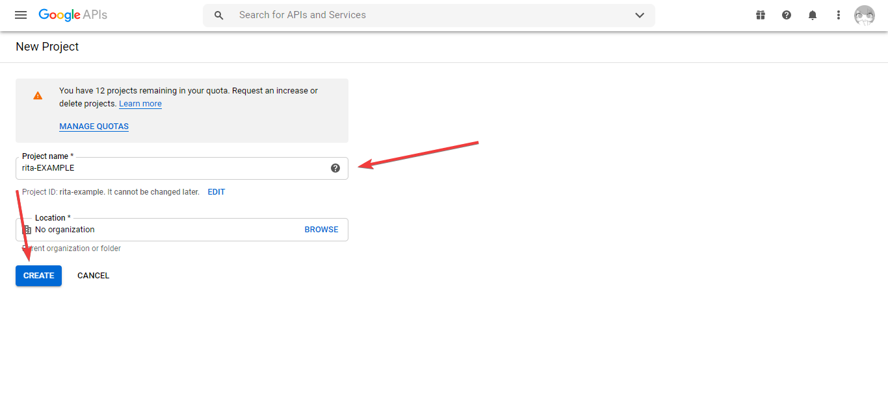

### Step 3: Enabing the API
Once the project is created make sure you are currently viewing the information for that project. Then click on `+ Enable APIs and Services` to search for the `YouTube Data API v3`
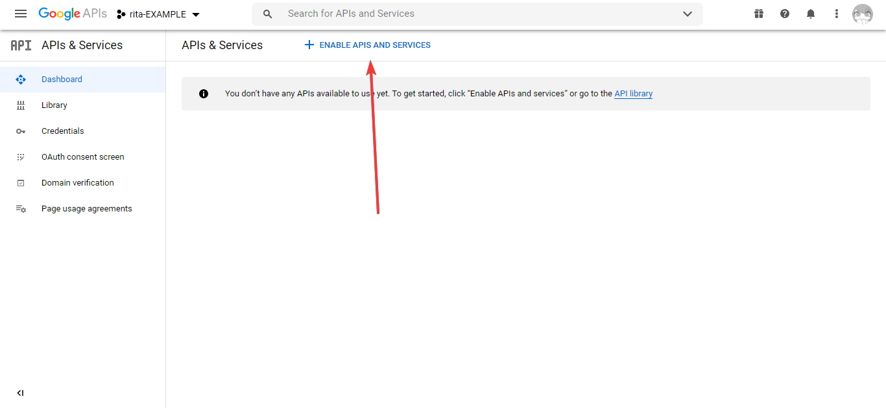

When you find the Data API for YouTube, click on it.
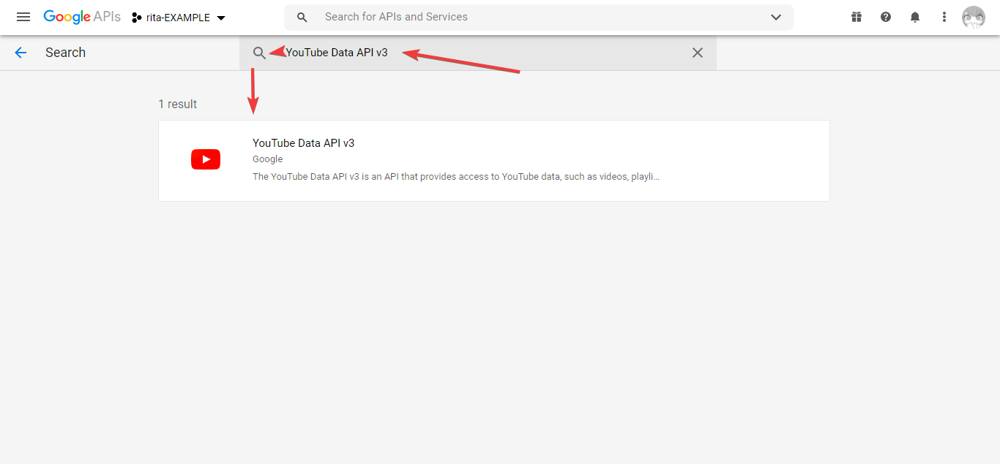

You need to enable this API for the bot to get access to it.
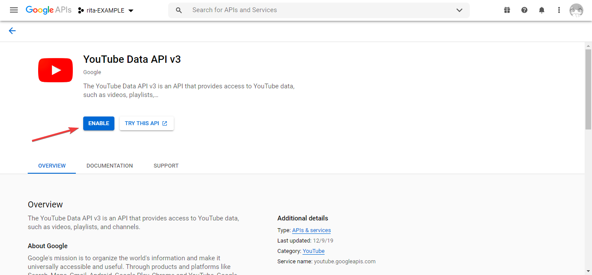

### Step 4: Getting the API Key
Go to the credentials tab once the API has been enabled. Then click on `+ Create Credentials` > `API Key`.
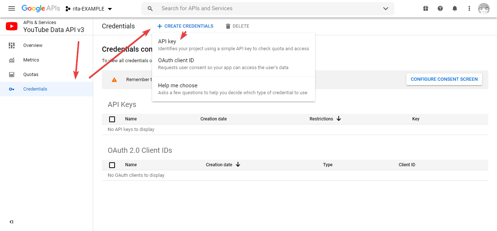
You should now be able to see a popup with a key, copy that key and put it into the `google` field of the `util.js` file located in `./resources/util.js`
